# OWLG — Optimized Owl GeoTIFF

**A raster format with a hard per-pixel error bound.** For `--delta d`, every pixel of
every band satisfies `|original - decoded| <= d`. Not on average. Not at the 99th
percentile. Every pixel, provably, and `owlg verify` proves it over the whole raster.

At `--delta 0` a round trip is bit-identical to the original GeoTIFF.

This repository also contains **OWLGT**, a web tile pyramid built from the same codec,
served over OGC API - Tiles/Maps and WMS 1.3.0; a **QGIS plugin** that reads `.owlg`
files in place without decoding them to a GeoTIFF copy; a **pip** package; and a
zero-dependency **npm** package.

```bash
pip install "owlg[full] @ git+https://github.com/fakmalpradana/owlait-owlg.git"

owlg encode ortho.tif ortho.owlg --delta 2      # 6.1x smaller than raw, 3.1x smaller than a lossless GeoTIFF
owlg encode ortho.tif small.owlg --target 20x   # 20x smaller than raw: the encoder finds the smallest bound (+/-14 DN here)
owlg verify small.owlg ortho.tif                # proves the bound over every one of 6.6 M pixels
owlg vrt    ortho.owlg                          # now QGIS and gdalinfo read it directly
```

Version 0.1.0. New here? Start with **[docs/getting-started.md](docs/getting-started.md)**.

---

## Why a bound, and not just a smaller file

Lossy codecs are compared by average error, and averages hide the pixel that matters.
On the drone orthophoto used throughout this README, JPEG 2000 — the same wavelet family
as ECW — reaches 20x with a respectable RMSE of 3.0 and a worst pixel off by **44 DN**.
JPEG XL at distance 1 has an RMSE of 3.1 and a worst pixel off by **125 DN** (its XYB
colour space spends blue precision on what the eye cannot see). If that pixel sits on a
building edge you are classifying, or in a shadow you are thresholding, the average never
told you.

OWLG stores a lossy base layer plus a **correction layer** that is entropy-coded against
a hard bound. The base layer can be as aggressive as you like; the correction layer
drags every pixel back inside `±delta` before the file is written. So you choose the
error you can tolerate, and the format guarantees it rather than hoping for it.

| drone orthophoto, 6.6 MB raw | size | vs raw | RMSE | worst pixel |
|---|---:|---:|---:|---:|
| GeoTIFF JPEG q85 | 1.307 MB | 5.1x | 2.98 | **29 DN** |
| JPEG XL distance 1 | 0.449 MB | 14.8x | 3.08 | **125 DN** |
| JPEG 2000 q10 | 0.666 MB | 10.0x | 1.26 | **15 DN** |
| JPEG 2000 q5 | 0.334 MB | 19.9x | 2.96 | **44 DN** |
| OWLG `--delta 2` | 1.090 MB | 6.1x | 1.10 | **2 DN, guaranteed** |
| OWLG `--delta 8` | 0.473 MB | 14.0x | 2.62 | **8 DN, guaranteed** |
| OWLG `--target 20x` (lands on delta 14) | 0.296 MB | 22.5x | 3.92 | **14 DN, guaranteed** |

At the *same worst-pixel error* OWLG is the smaller file: delta 8 gives 14.0x where
JPEG 2000 with a worst pixel of 15 gives 10.0x. And OWLG's number is a promise written
in the header; the others are what happened to this image.

*(reproduce with `python benchmarks/bench_options.py your_ortho.tif --deep`; the JP2
rows use OpenJPEG through GDAL. ECW itself needs a proprietary SDK GDAL builds rarely
ship — measuring against real `.ecw` files is on the list.)*

---

## Contents

- [Install](#install)
- [Quick start](#quick-start) — and the longer [getting-started guide](docs/getting-started.md)
- [Efficiency, option by option](#efficiency-option-by-option)
- [Large rasters: 10–100 GB](#large-rasters-10100-gb)
- [QGIS plugin](#qgis-plugin)
- [Python API](#python-api)
- [JavaScript / Node](#javascript--node)
- [OWLGT web tiles and serving](#owlgt-web-tiles-and-serving)
- [Machine learning pipeline](#machine-learning-pipeline)
- [Encryption](#encryption)
- [How it works](#how-it-works)
- [Repository layout](#repository-layout)
- [Reproducing the numbers](#reproducing-the-numbers)
- [Known limitations](#known-limitations)
- [Contributing](#contributing)
- [Licence](#licence)

---

## Install

### Python (pip)

Not on PyPI yet, so install from the repository (the extras work the same way):

```bash
pip install "owlg[full] @ git+https://github.com/fakmalpradana/owlait-owlg.git"   # everything
pip install "owlg @ git+https://github.com/fakmalpradana/owlait-owlg.git"         # reader only; numpy is the single hard dependency
```

Or from a clone:

```bash
git clone https://github.com/fakmalpradana/owlait-owlg.git
cd owlait-owlg
pip install -e .[dev]
pytest -q                   # 226 tests
```

The extras are deliberately granular, because the point of a small reader is that it
installs anywhere:

| Extra | Pulls in | What you gain |
|---|---|---|
| *(none)* | numpy | Read `.owlg` whose base layer your environment can already decode |
| `codecs` | imagecodecs | AVIF / WebP / JPEG XL base layers |
| `encode` | rasterio + imagecodecs | Writing `.owlg` at all |
| `fast` | numba | ~26x faster exact decoding (140 ms vs 3.7 s per 512 px window) |
| `crypto` | cryptography | Faster AES-256-GCM; a pure-Python fallback ships in the package |
| `pillow` | pillow | An alternative image backend when imagecodecs is unavailable |
| `full` | all of the above | |

Check what your environment can actually do — this runs real probe decodes, it does not
just test whether a module imports:

```
$ owlg check
image backends : imagecodecs, pillow+avif
GeoTIFF writer : rasterio
encryption     : cryptography
numba          : present
real decode probes:
  avif : YES
  webp : YES
  jxl  : YES
```

### Node (npm)

```bash
npm install github:fakmalpradana/owlait-owlg#main:packages/owlg-js   # not on npm yet; zero dependencies, ~10 kB
npx owlg info file.owlg
```

### QGIS plugin

Build the plugin zip and install it through **Plugins ▸ Manage and Install Plugins ▸
Install from ZIP**, then **restart QGIS**:

```bash
python scripts/build_all.py            # writes dist/owlg_qgis-0.1.0.zip
```

---

## Quick start

```bash
# Lossless: revert is bit-identical, SHA-256 verified
owlg encode ortho.tif ortho.owlg
owlg decode ortho.owlg back.tif --check-sha

# Near-lossless with a guaranteed bound
owlg encode ortho.tif small.owlg --delta 2
owlg verify small.owlg ortho.tif
#   error  : max=2 (bound +/-2) -> BOUND PROVEN

# A size goal instead: the encoder searches the smallest bound that reaches it
owlg encode ortho.tif tiny.owlg --target 20x --base avif
#   -> delta 14 (+/-14 DN) is the smallest bound that reaches 20x
#   target 20x reached: 22.5x with a guaranteed bound of +/-14 DN

# Read it in QGIS / gdalinfo / rasterio without decoding a copy
owlg vrt small.owlg
export GDAL_VRT_ENABLE_PYTHON=YES
gdalinfo small.owlg.vrt

# Web tiles, then serve them over OGC API and WMS
gdalwarp -t_srs EPSG:3857 ortho.tif ortho3857.tif
owlg tiles ortho3857.tif map.owlgt --minzoom 16 --maxzoom 20
owlg serve map.owlgt --port 8080
```

Full flag-by-flag reference: **[docs/cli.md](docs/cli.md)**. On a terminal the CLI
colours its output — a green `BOUND PROVEN`, a red `*** VIOLATED ***`, progress bars for
the quality search and tile rows, `info` as a key/value sheet with a pyramid table. Piped
or under `NO_COLOR` it prints exactly the same words, plain.

---

## Efficiency, option by option

Every number below was produced by `benchmarks/bench_options.py` (A–C) and
`benchmarks/bench_large.py` (D) on the machine that wrote this README, and can be
regenerated on yours. Four rasters are shown because compression ratios depend enormously
on the imagery: satellite scenes and drone orthophotos do not behave alike, and quoting
only the flattering one would be dishonest. D is the one that matters for production: a
169 MPixel orthophoto that goes through the tiled layout, with every lossy format's error
measured pixel by pixel.

Two columns matter. **vs raw** is against the uncompressed pixels (`width x height x
bands`), the number a 20x goal is measured in. **vs GeoTIFF** is against a
`DEFLATE + PREDICTOR=2` GeoTIFF, which is what most people mean by "the lossless file I
already have". The JPEG 2000 rows are OpenJPEG through GDAL — the closest freely writable
stand-in for ECW, which uses the same wavelet approach.

### A. A drone orthophoto — 1471 × 1128 × 4, RGBA, 6.6 MB raw

The representative case for photogrammetry. The alpha band is constant and costs nothing.
Not redistributable, so this table is evidence rather than something you can rerun.

**Reference formats**

| Option | Size | vs raw | vs GeoTIFF | max err | RMSE |
|---|---:|---:|---:|---:|---:|
| GeoTIFF DEFLATE+pred (lossless) | 3.353 MB | 1.98x | 1.00x | **0** | 0.000 |
| GeoTIFF ZSTD (lossless) | 3.283 MB | 2.02x | 1.02x | **0** | 0.000 |
| JPEG 2000 lossless | 1.986 MB | 3.34x | 1.69x | **0** | 0.000 |
| JPEG XL lossless | 1.889 MB | 3.51x | 1.78x | **0** | 0.000 |
| GeoTIFF JPEG q85 (lossy) | 1.307 MB | 5.08x | 2.56x | 29 | 2.975 |
| GeoTIFF JPEG q75 (lossy) | 0.999 MB | 6.64x | 3.36x | 40 | 4.074 |
| JPEG 2000 q25 (lossy) | 1.251 MB | 5.31x | 2.68x | 4 | 0.555 |
| JPEG 2000 q10 (lossy) | 0.666 MB | 9.96x | 5.03x | 15 | 1.263 |
| JPEG 2000 q5 (lossy) | 0.334 MB | 19.86x | 10.03x | 44 | 2.957 |
| JPEG 2000 q3 (lossy) | 0.202 MB | 32.91x | 16.63x | 59 | 4.943 |
| JPEG XL distance 1 (lossy) | 0.449 MB | 14.77x | 7.46x | 125 | 3.080 |
| JPEG XL distance 2 (lossy) | 0.280 MB | 23.70x | 11.97x | 106 | 4.423 |

**OWLG lossless — revert is bit-identical**

| Option | Size | vs raw | vs GeoTIFF | max err |
|---|---:|---:|---:|---:|
| `--delta 0 --base webp` *(default: portable)* | 2.405 MB | 2.76x | 1.39x | **0** |
| `--delta 0 --base avif` | 2.298 MB | 2.89x | 1.46x | **0** |
| `--delta 0 --base jxl` *(smallest; needs a JXL decoder)* | 1.884 MB | 3.52x | 1.78x | **0** |
| `--delta 0 --layout tiled` *(constant RAM + pyramid)* | 2.490 MB | 2.67x | 1.35x | **0** |

**OWLG near-lossless — the hard bound**

| Option | Size | vs raw | vs GeoTIFF | max err | RMSE |
|---|---:|---:|---:|---:|---:|
| `--delta 1` | 1.481 MB | 4.48x | 2.26x | 1 | 0.695 |
| `--delta 2` | 1.090 MB | 6.09x | 3.08x | 2 | 1.098 |
| `--delta 3` | 0.873 MB | 7.60x | 3.84x | 3 | 1.350 |
| `--delta 5` | 0.636 MB | 10.44x | 5.27x | 5 | 1.928 |
| `--delta 8` | 0.473 MB | 14.04x | 7.09x | 8 | 2.623 |
| `--delta 12` | 0.355 MB | 18.67x | 9.43x | 12 | 3.790 |
| `--delta 16` | 0.283 MB | 23.44x | 11.84x | 16 | 4.566 |
| `--delta 2 --base avif` | 1.034 MB | 6.42x | 3.24x | 2 | 1.112 |
| **`--target 20x`** *(encoder chose delta 14)* | 0.316 MB | **21.02x** | 10.62x | 14 | 3.955 |
| **`--target 20x --base avif`** *(delta 14)* | 0.296 MB | **22.46x** | 11.34x | 14 | 3.922 |

Read the two families together. At a worst pixel of 15, JPEG 2000 gives 10.0x; OWLG at a
*guaranteed* 8 gives 14.0x. At ~20x, JPEG 2000 lets a pixel drift 44 DN and JPEG XL 106;
OWLG holds every pixel within 14. The bound costs nothing here — it is what makes the
file smaller, because the base layer is free to be aggressive when a cheap correction
layer is going to catch the outliers.

**Layout, recovery tier, encryption** (at `--delta 2`)

| Option | Size | vs raw | max err | Note |
|---|---:|---:|---:|---|
| `--layout tiled` | 1.173 MB | 5.66x | 2 | constant RAM, 5 pyramid levels at q50 |
| `--layout tiled --no-overviews` | 1.096 MB | 6.06x | 2 | the pyramid costs ~7% |
| `--recovery` | 2.481 MB | 2.68x | **0** | ships light (1.090 MB), reverts bit-identical |
| `--encrypt` | 1.090 MB | 6.09x | 2 | AES-256-GCM costs ~0.1% |

**OWLGT web tiles** (z14–19)

| Option | Size | vs raw | vs gdal2tiles |
|---|---:|---:|---:|
| `--profile view --q 50` | 0.363 MB | 18.3x | **19.6x smaller** |
| `--profile view --q 72` *(default)* | 0.695 MB | 9.6x | **10.2x smaller** |
| `--profile exact --delta 3` | 1.811 MB | 3.7x | 3.9x smaller |
| gdal2tiles PNG tree (91 tiles) | 7.109 MB | 0.93x | 1.00x |
| MBTiles PNG | 6.648 MB | 1.00x | 1.07x |

### B. A larger drone orthophoto — 2937 × 2252 × 4, 26.5 MB raw

Same sensor family, four times the pixels, more texture. 20x needs a wider bound here.

| Option | Size | vs raw | vs GeoTIFF | max err |
|---|---:|---:|---:|---:|
| GeoTIFF DEFLATE+pred | 14.573 MB | 1.82x | 1.00x | **0** |
| GeoTIFF JPEG q85 | 5.559 MB | 4.76x | 2.62x | 34 |
| JPEG 2000 q10 | 2.647 MB | 9.99x | 5.50x | 21 |
| JPEG 2000 q5 | 1.324 MB | 19.98x | 11.00x | 63 |
| OWLG `--delta 0` | 10.169 MB | 2.60x | 1.43x | **0** |
| OWLG `--delta 2` | 4.813 MB | 5.50x | 3.03x | 2 |
| OWLG `--delta 2 --layout tiled` | 5.179 MB | 5.11x | 2.81x | 2 |
| OWLG `--delta 5` | 2.838 MB | 9.32x | 5.13x | 5 |
| OWLG `--delta 8` | 2.118 MB | 12.49x | 6.88x | 8 |
| OWLG `--delta 12` | 1.615 MB | 16.38x | 9.02x | 12 |
| OWLG `--delta 16` | 1.285 MB | 20.59x | 11.34x | 16 |
| **OWLG `--target 20x --base avif`** *(delta 16)* | 1.236 MB | **21.40x** | 11.79x | 16 |
| OWLGT `view q72` | 3.825 MB | 6.9x | — | — |
| gdal2tiles (430 tiles) | 40.046 MB | 0.66x | — | — |

### C. `samples/rgb_small.tif` — 791 × 718 × 3, Landsat 7, ships with this repo

Satellite imagery is noisier per pixel than aerial imagery and compresses worse at every
bound. This is the raster you can rerun.

| Option | Size | vs raw | vs GeoTIFF | max err | RMSE |
|---|---:|---:|---:|---:|---:|
| GeoTIFF DEFLATE+pred | 0.779 MB | 2.19x | 1.00x | **0** | 0.000 |
| GeoTIFF JPEG q85 | 0.384 MB | 4.44x | 2.03x | 30 | 3.710 |
| JPEG 2000 q10 | 0.173 MB | 9.86x | 4.51x | 31 | 2.680 |
| JPEG 2000 q5 | 0.088 MB | 19.43x | 8.88x | 81 | 5.346 |
| JPEG XL distance 1 | 0.137 MB | 12.41x | 5.67x | 86 | 4.228 |
| OWLG `--delta 0` | 0.676 MB | 2.52x | 1.15x | **0** | 0.000 |
| OWLG `--delta 3` | 0.285 MB | 5.98x | 2.73x | 3 | 1.483 |
| OWLG `--delta 8` | 0.162 MB | 10.55x | 4.82x | 8 | 2.743 |
| OWLG `--delta 12` | 0.124 MB | 13.77x | 6.30x | 12 | 3.790 |
| OWLG `--delta 16` | 0.101 MB | 16.81x | 7.68x | 16 | 4.649 |
| OWLG `--target 20x` *(delta 24)* | 0.076 MB | 22.52x | 10.30x | 24 | — |

Full tables, including LZW/ZSTD/COG, recovery and encryption rows and the OWLGT
comparison for every raster, are in [`results/`](results/). What was tried to push these
numbers further, and why the correction coder was left alone, is in
[`results/codec_experiments_2026-09.md`](results/codec_experiments_2026-09.md).

### D. A 169 MPixel orthophoto — 12986 × 12986 × 4, 674.5 MB raw (`FT2026_crop.tif`)

A production-size aerial orthophoto at 6.6 cm/pixel (UTM 49S), 899 MB as delivered
(uncompressed, with overviews). The fourth band is a constant 255 and costs nothing. This
is the raster the 20x target was set for; it is also too large for the flat layout, so
every OWLG row is `--layout tiled` with the base-only overview pyramid included in the
size. The **max err** column is measured over all 169 M pixels of every band by decoding
each file back and diffing it against the original (`owlg diff`); for OWLG that is the
proof of the bound, not a claim. Not redistributable.

**Lossless, and the lossy formats a GIS user would actually make**

| Option | Size | vs raw | vs GeoTIFF | max err | RMSE | enc | dec |
|---|---:|---:|---:|---:|---:|---:|---:|
| GeoTIFF DEFLATE + predictor (lossless) | 375.1 MB | 1.8x | 1.0x | **0** | 0.00 | 53 s | — |
| GeoTIFF ZSTD (lossless) | 361.0 MB | 1.9x | 1.0x | **0** | 0.00 | 9 s | — |
| JPEG 2000 lossless | 227.9 MB | 3.0x | 1.6x | **0** | 0.00 | 5 s | — |
| JPEG XL lossless | 215.8 MB | 3.1x | 1.7x | **0** | 0.00 | 19 s | — |
| **OWLG `--delta 0`** (bit-identical) | 269.0 MB | 2.5x | 1.4x | **0** | 0.00 | 75 s | 76 s |
| GeoTIFF JPEG q85 (RGB only) | 110.3 MB | 6.1x | 3.4x | 32 | 2.55 | 3 s | — |
| GeoTIFF JPEG q75 (RGB only) | 83.7 MB | 8.1x | 4.5x | 54 | 3.31 | 3 s | — |
| JPEG 2000 q25 | 143.8 MB | 4.7x | 2.6x | 6 | 0.64 | 5 s | — |
| JPEG 2000 q10 | 67.4 MB | 10.0x | 5.6x | 22 | 1.49 | 4 s | — |
| JPEG 2000 q5 | 33.7 MB | 20.0x | 11.1x | 46 | 2.67 | 4 s | — |
| JPEG 2000 q3 | 20.2 MB | 33.4x | 18.5x | 71 | 3.88 | 4 s | — |
| JPEG 2000 q2 | 13.5 MB | 50.0x | 27.8x | 135 | 5.02 | 4 s | — |
| JPEG XL distance 1 | 38.1 MB | 17.7x | 9.8x | 115 | 2.88 | 20 s | — |
| JPEG XL distance 2 | 22.6 MB | 29.8x | 16.6x | 157 | 3.90 | 20 s | — |
| JPEG XL distance 4 | 12.5 MB | 53.8x | 29.9x | 159 | 5.45 | 19 s | — |

**OWLG, hard per-pixel bound, delta 2 → 32**

| Option | Size | vs raw | vs GeoTIFF | max err | RMSE | enc | dec |
|---|---:|---:|---:|---:|---:|---:|---:|
| OWLG `--delta 2` | 130.4 MB | 5.2x | 2.9x | 2 | 1.16 | 61 s | 49 s |
| OWLG `--delta 4` | 86.1 MB | 7.8x | 4.4x | 4 | 1.89 | 53 s | 44 s |
| OWLG `--delta 8` | 52.5 MB | 12.8x | 7.1x | 8 | 2.81 | 48 s | 41 s |
| OWLG `--delta 16` | 29.3 MB | 23.1x | 12.8x | 16 | 5.08 | 38 s | 42 s |
| OWLG `--delta 32` | 20.2 MB | 33.4x | 18.6x | 32 | 5.56 | 37 s | 39 s |
| OWLG `--delta 2` `--base avif` | 116.5 MB | 5.8x | 3.2x | 2 | 1.16 | 121 s | 53 s |
| OWLG `--delta 4` `--base avif` | 74.7 MB | 9.0x | 5.0x | 4 | 1.80 | 108 s | 47 s |
| OWLG `--delta 8` `--base avif` | 45.1 MB | 15.0x | 8.3x | 8 | 3.06 | 94 s | 42 s |
| OWLG `--delta 16` `--base avif` | 23.5 MB | 28.7x | 15.9x | 16 | 4.69 | 81 s | 42 s |
| OWLG `--delta 32` `--base avif` | 10.7 MB | 63.3x | 35.2x | 32 | 6.74 | 68 s | 39 s |

**What the pixels look like**

The same 320 × 320 window (pixel 6000, 8000 — a planted terrace with kerbs and gravel,
the most detailed patch a variance scan found) from the original and from each file,
the centre 80 × 80 pixels at 4x, and an error map: `|decoded − original|`, the worst of
the three bands, on one fixed scale (black 0, white ≥ 64 DN) so the maps compare across
rows. Produced by `benchmarks/visual_crops.py`; nothing is retouched.

| | Crop (native) | Centre, 4x | \|error\| (0–64 DN) | Size | max err in this crop |
|---|---|---|---|---:|---:|
| **Original** | 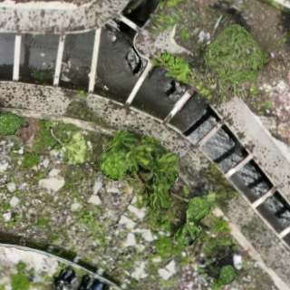 | 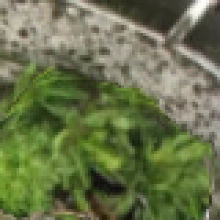 | 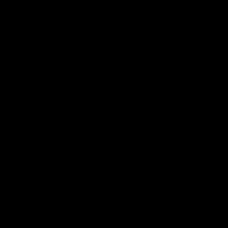 | 674.5 MB raw | 0 |
| **GeoTIFF JPEG q75** |  |  | 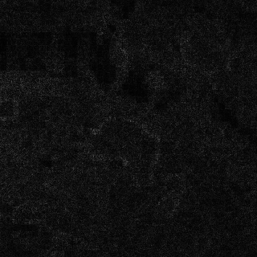 | 83.7 MB | 35 |
| **JPEG 2000 q3** |  |  | 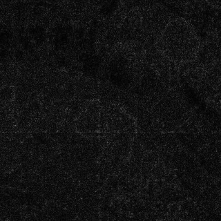 | 20.2 MB | 37 |
| **JPEG 2000 q2** |  | 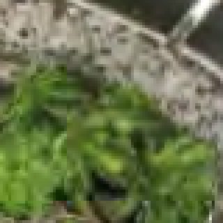 | 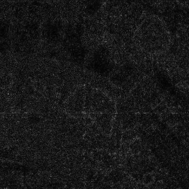 | 13.5 MB | 46 |
| **JPEG XL distance 4** |  | 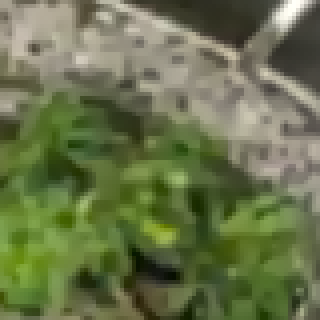 | 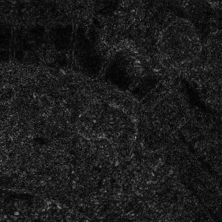 | 12.5 MB | 72 |
| **OWLG delta 8** |  |  | 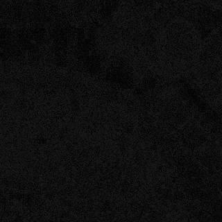 | 52.5 MB | 8 |
| **OWLG delta 16** |  | 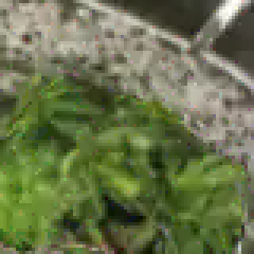 |  | 29.3 MB | 16 |
| **OWLG delta 32** |  | 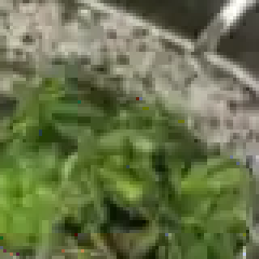 | 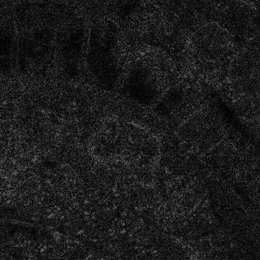 | 20.2 MB | 32 |
| **OWLG delta 32, AVIF** | 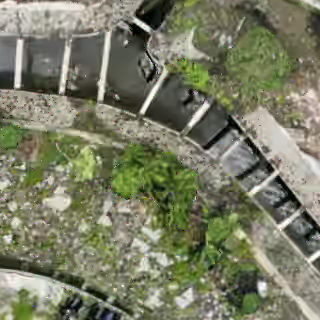 | 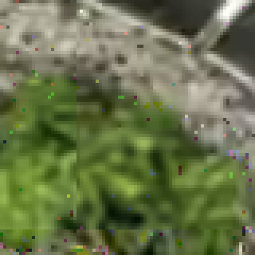 | 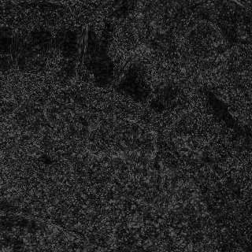 | 10.7 MB | 32 |

At native scale every row looks fine — that is the problem with judging codecs by eye.
The error maps show where the bytes went: JPEG 2000 and JPEG XL leave a haze of noise
over every textured surface and their worst pixels sit on the kerb edges; OWLG's maps
are dark up to the bound and nothing is brighter than it, because nothing can be. JPEG XL
distance 4 is the smallest file (12.5 MB) and the brightest map; OWLG `--delta 32 --base
avif` is smaller (10.7 MB) and its map is capped at 32.

Reading the two tables together:

- **At the same size, the bound is 2–5x tighter than what wavelets or JPEG XL actually
  do.** JPEG 2000 q3 and OWLG `--delta 32` are the same 20.2 MB; the worst JPEG 2000
  pixel is off by 71, the worst OWLG pixel by 32 — and that 32 is written in the header
  and proven, not observed. JPEG 2000 q2 (13.5 MB) has a worst pixel of 135; JPEG XL
  distance 4 (12.5 MB) has 159. OWLG `--delta 32 --base avif` is smaller than both at
  10.7 MB, 63x vs raw, worst pixel 32.
- **20x vs raw is reached at `--delta 16`** with the default WebP base (29.3 MB, 23x), and
  `--delta 16 --base avif` gives 28.7x. On this imagery the goal set for 0.1.0 is met
  with a bound of 6 % of the 8-bit range.
- **Below delta 8 the bound is nearly free.** OWLG `--delta 4` (86 MB, worst pixel 4) is
  the size of GeoTIFF JPEG q75 (84 MB for three bands only, worst pixel 54) and 40 %
  smaller than JPEG 2000 q25 (144 MB, worst pixel 6).
- **RMSE is not what OWLG optimises**, and it shows: JPEG 2000 q3 has a lower RMSE
  (3.88) than OWLG `--delta 32` (5.56) at the same size. OWLG spends its bytes on the
  worst pixel; the wavelet spends them on the average one. Pick by what your analysis
  can tolerate — a classifier or a change detector fails on the outlier, not the mean.
- **Lossless**: JPEG XL (216 MB) and JPEG 2000 (228 MB) beat OWLG `--delta 0` with a
  WebP base (269 MB). For a bit-identical archive of a raster this size use one of
  them, or `--base jxl`; OWLG's case is the bounded-lossy range.
- **Speed**: 169 MPixel encodes in 37–75 s (WebP) or 68–121 s (AVIF) single-threaded,
  and decodes in 40–76 s; GDAL's JPEG 2000 is ten times faster in both directions. An
  ECW of this scene exists (15.4 MB), but no free decoder was available on the test
  machine, so it is not in the table; the wavelet rows above are the closest stand-in.

### Which option should I use?

| If you want | Use |
|---|---|
| An archival master, byte-for-byte | `--delta 0` (add `--base jxl` for the smallest, if your readers have JXL) |
| A working copy for analysis | `--delta 1` or `--delta 2` |
| A distribution copy for viewing | `--delta 3` to `--delta 8` |
| The smallest file that still carries a written bound | `--target 20x --base avif` (lands on delta 12–16 for aerial imagery; `--target 44x` landed on delta 24 for the 169 MPixel ortho) |
| Both at once | `--delta 2 --recovery`, then `owlg split` |
| A raster over ~16 MPixel | nothing — `--layout auto` already picks `tiled` |
| Maximum portability | `--base webp` (the default) |
| Minimum size at a given bound | `--base avif` |
| Web delivery | `owlg tiles … --profile view` |
| Web delivery that stays analysable | `owlg tiles … --profile exact --delta 3` |

---

## Large rasters: 10–100 GB

The flat layout holds the whole raster in memory. The **tiled layout** does not: tiles
are independent blobs, encoding streams tile by tile, and the reader keeps a bounded LRU
cache. `--layout auto` selects it above 16 MPixel.

```bash
owlg encode huge.tif huge.owlg --delta 2            # auto -> tiled
owlg encode huge.tif huge.owlg --delta 2 --layout tiled --tile 512
owlg verify huge.owlg huge.tif                      # streams; never loads the raster
```

Measured on one machine, same imagery scaled up, GDAL block cache capped at 256 MB:

| Raster | Raw | Peak RAM above baseline | Encode time |
|---|---:|---:|---:|
| 4 096² × 3 | 0.050 GB | **0.220 GB** | 13 s |
| 8 192² × 3 | 0.201 GB | **0.236 GB** | 43 s |
| 16 384² × 3 | 0.805 GB | **0.239 GB** | 164 s |

Data grows 16x; memory grows 8%. Time is linear, memory is flat — which is what makes
100 GB a question of patience rather than of hardware. Extrapolating: roughly 5.7 hours
single-threaded at the same ~0.24 GB.

Reading is windowed. On the 16 384² file (242.8 MB, 7 pyramid levels), through GDAL:

| | without numba | with numba |
|---|---:|---:|
| Open the file | 8 ms | 8 ms |
| 512² window, exact, cold | 3 726 ms | **140 ms** |
| Same window, cached | 1 ms | 1 ms |
| Coarsest overview, whole level | 5 ms | 4 ms |
| 512² window, base-layer preview | 47–82 ms | 47–82 ms |

Zooming out never touches level 0, because the pyramid levels are base-only. That is why
opening a 100 GB file feels like opening a small one.

**Integrity without loading the raster.** Tiled files carry `sha256_scan`: a SHA-256 over
a defined tile-scan serialization, computed as the encoder streams and recomputed the same
way by `owlg verify`. Never more than one tile is in memory. The digest is of the
*original* pixels, so verifying proves two things at once:

```
$ owlg verify huge.owlg huge.tif
shape  : same  (268.4 MPixel x 3 bands = 805.3 M samples checked)
error  : max=2 (bound +/-2) -> BOUND PROVEN
digest : original pixels MATCH (ebcc7dca28cc7d64...) -> this file really came from huge.tif
geo    : transform same, crs same
```

---

## QGIS plugin

The plugin loads a `.owlg` **as itself**. It writes a small `.vrt` sidecar containing a
Python pixel function, so GDAL — and therefore QGIS — treats it as an ordinary raster
while every block request is routed to the OWLG decoder. Only the tiles on screen are
decoded. No GeoTIFF copy is created, so the disk footprint stays the size of the `.owlg`
plus a few kB.

```
Plugins ▸ Manage and Install Plugins ▸ Install from ZIP ▸ dist/owlg_qgis-0.1.0.zip
Restart QGIS.  Then drag a .owlg onto the canvas.
```

The decoder is vendored inside the plugin — nothing to `pip install` into the QGIS
Python. From QGIS it needs only numpy plus one of Pillow / GDAL, both of which QGIS
always ships.

**If a direct read fails, the plugin says so.** It used to log the failure and quietly
decode the whole raster to a GeoTIFF cache instead, which is why the Layer Information
panel would report `GTiff` and a size that had nothing to do with the `.owlg`. It now
shows the cause and asks; a copy is only made if you accept it, and that layer is
labelled `[GeoTIFF copy]`. **OWLG ▸ Decoder diagnostics** runs a genuine self-test — a
4×4 pixel VRT with a trivial pixel function — so you can tell a GDAL policy problem from
a file problem.

Details, including the GDAL configuration involved: **[docs/qgis.md](docs/qgis.md)**.

---

## Python API

```python
import owlg
from owlg.tiled_read import TiledReader

# Encode
owlg.write_owlg("ortho.tif", "ortho.owlg", delta=2)

# Decode the whole thing
array, header = owlg.read_owlg("ortho.owlg")      # (bands, height, width) uint8
print(header["delta"], header["crs"])

# Or read one window of a very large file, with bounded memory
r = TiledReader("huge.owlg")
patch = r.read_window(band=0, xoff=4096, yoff=4096, xsize=512, ysize=512)
thumb = r.read_window(band=0, xoff=0, yoff=0, xsize=512, ysize=512, level=4)
r.close()
```

Full reference, every function exercised: **[docs/python-api.md](docs/python-api.md)**.

---

## JavaScript / Node

Zero dependencies, ES modules, works in the browser and in Node.

```js
import { openOWLG, decodeOWLG } from 'owlg';

const file = await openOWLG(bytes);
const { bands, width, height } = await decodeOWLG(file, {
  // The host supplies the base-layer image decoder. In a browser that is
  // createImageBitmap; Node has none built in, which is a real limitation.
  avifDecode: async (buf) => { /* ... */ },
});
```

```js
import { owlgtSource } from 'owlg/maplibre';   // or 'owlg/leaflet'
map.addSource('ortho', await owlgtSource('/map.owlgt'));
```

Full reference and the honest list of what the JS decoder does not yet do:
**[docs/node-api.md](docs/node-api.md)**.

---

## OWLGT web tiles and serving

`.owlgt` is a single-file tile pyramid: one container, an offset directory, and tiles
that share identical content are stored once. Two profiles:

- `--profile view` — display only, smallest;
- `--profile exact --delta N` — each tile carries the same hard bound as OWLG, so tiles
  remain usable for analysis rather than only for looking at.

```bash
gdalwarp -t_srs EPSG:3857 ortho.tif ortho3857.tif
owlg tiles ortho3857.tif map.owlgt --minzoom 16 --maxzoom 20 --profile view --q 72
owlg serve map.owlgt --port 8080
owlg revert map.owlgt back.tif --zoom 20 --t-srs EPSG:32749   # tiles -> GeoTIFF
```

`owlg serve` speaks both standards, from stdlib only:

```
OGC API landing   http://127.0.0.1:8080/
Collections       http://127.0.0.1:8080/collections
OGC API - Tiles   .../collections/<id>/map/tiles/WebMercatorQuad/{z}/{y}/{x}.png
XYZ (Leaflet)     http://127.0.0.1:8080/xyz/<id>/{z}/{x}/{y}.png
WMS 1.3.0         http://127.0.0.1:8080/wms?SERVICE=WMS&REQUEST=GetCapabilities&VERSION=1.3.0
```

The WMS implementation observes the 1.3.0 axis-order rule: `EPSG:4326` is lat,lon while
`CRS:84` is lon,lat. Getting that backwards is the classic way to produce a blank map.

### OWLGT against the usual tile answers

The 169 MPixel orthophoto of table D, warped to EPSG:3857 and tiled z14–z21 (2,890
non-empty tiles, 3,011 including fully transparent edge tiles that gdal2tiles writes and
OWLGT skips). The **max err** of OWLGT is against the tile pyramid it was built from, over
every tile of every zoom; the JPEG and WEBP trees are measured against their own PNG
twin on opaque pixels only, so the number is the codec's error and nothing else.

| Option | Size | vs raw | vs GeoTIFF | max err | RMSE | enc | dec |
|---|---:|---:|---:|---:|---:|---:|---:|
| OWLGT `--profile exact --delta 2` | 132.4 MB | 5.1x | 2.8x | 2 | 1.34 | 157 s | — |
| OWLGT `--profile exact --delta 4` | 83.0 MB | 8.1x | 4.5x | 4 | 2.21 | 149 s | — |
| OWLGT `--profile exact --delta 8` | 46.0 MB | 14.7x | 8.2x | 8 | 3.15 | 150 s | — |
| OWLGT `--profile exact --delta 16` | 26.6 MB | 25.4x | 14.1x | 16 | 7.62 | 152 s | — |
| OWLGT `--profile exact --delta 32` | 11.8 MB | 57.2x | 31.8x | 32 | 14.71 | 150 s | — |
| OWLGT `--profile view --q 72` | 35.1 MB | 19.2x | 10.7x | 90 | 3.28 | 125 s | — |
| OWLGT `--profile view --q 50` | 17.1 MB | 39.4x | 21.9x | 131 | 5.51 | 122 s | — |
| gdal2tiles PNG (3011 files) | 374.0 MB | 1.8x | 1.0x | **0** | 0.00 | 23 s | — |
| gdal2tiles JPEG q75 (3011 files) | 36.5 MB | 18.5x | 10.3x | 111 | 4.38 | 8 s | — |
| gdal2tiles WEBP q75 (3011 files) | 26.4 MB | 25.6x | 14.2x | 84 | 4.72 | 12 s | — |
| MBTiles PNG | 336.1 MB | 2.0x | 1.1x | **0** | 0.00 | 60 s | — |
| MBTiles JPEG q75 | 39.6 MB | 17.0x | 9.5x | 112 | 4.25 | 25 s | — |
| MBTiles WEBP q75 | 29.7 MB | 22.7x | 12.6x | 89 | 4.66 | 38 s | — |

- OWLGT `--profile exact --delta 32` is the smallest thing in the table, 11.8 MB for the
  whole pyramid, and still bounded. Every unbounded alternative — JPEG or WEBP tiles at
  q75, OWLGT `view` — has a worst pixel of 84–131.
- At `--delta 2`–`8` the exact profile costs about the same as the flat OWLG of the same
  bound; you get web tiles for free.
- The exact profile's RMSE climbs at delta 16–32 (7.6, 14.7) although the bound holds.
  Above delta 8 most tiles are coded as a residual against their upsampled parent tile
  rather than as a standalone AVIF, which is cheaper but leaves more pixels near the edge
  of the bound. If average error matters more than size at large delta, use OWLG.

**Tile latency** — one finest-zoom tile, p50 / p95 over 200 random tiles, single thread.
For OWLGT: decode plus PNG encode of the response ("decode only" is the codec alone;
"warm" is a second request for the same tile, served from the decoded-tile cache). For
the PNG tree a file read, for MBTiles a SQLite fetch — that is all a static tile server
does. HTTP rows are end to end on localhost.

| Source | p50 | p95 | decode only | warm (cached) |
|---|---:|---:|---:|---:|
| OWLGT view q72 | 2.8 ms | 3.3 ms | 0.7 ms | 2.1 ms |
| OWLGT exact delta2 | 5.8 ms | 10.9 ms | 3.5 ms | 2.2 ms |
| OWLGT exact delta4 | 5.1 ms | 6.0 ms | 2.7 ms | 2.3 ms |
| OWLGT exact delta8 | 4.7 ms | 7.8 ms | 2.5 ms | 2.2 ms |
| OWLGT exact delta16 | 18.2 ms | 22.7 ms | 16.1 ms | 2.5 ms |
| OWLGT exact delta32 | 17.9 ms | 19.4 ms | 15.6 ms | 2.2 ms |
| gdal2tiles PNG tree | 0.22 ms | 0.27 ms | — | — |
| MBTiles PNG | 0.48 ms | 0.77 ms | — | — |
| HTTP: owlg serve (exact delta=4) | 5.31 ms | 6.07 ms | — | — |
| HTTP: python -m http.server (PNG tree) | 0.23 ms | 0.50 ms | — | — |

- A static PNG tree is 20x faster to serve than OWLGT: it does no work. OWLGT trades
  that for 4–30x less storage. At 3–6 ms per tile one core serves ~200 tiles/s cold;
  `owlg serve` is a stdlib demo server, not a production one — put a cache in front.
- Residual tiles (most tiles at delta 16–32) decode their parent chain first, hence
  16 ms cold; the parents are cached, so neighbouring tiles come in at 2 ms.
- Half of the served time is PNG encoding of the response. `owlg serve` uses zlib level
  1 for that (2.5x faster than level 6 for 4 % more bytes); asking for `.webp` or `.jpg`
  instead of `.png` is cheaper still.

---

## Machine learning pipeline

```bash
owlg npy ortho.owlg data.npy --layout CHW
owlg npy ortho.owlg data.npz --format npz
owlg npy ortho.owlg data.dat --format memmap     # for rasters larger than RAM
```

```python
from owlg.ml import OwlgDataset, patches

for patch in patches("ortho.owlg", size=256, stride=256):
    ...                                   # (bands, 256, 256) uint8

ds = OwlgDataset("ortho.owlg", size=512)  # indexable, PyTorch-friendly
```

---

## Encryption

`--encrypt` applies AES-256-GCM to every blob **and to the header**, so dimensions, CRS
and the blob directory are encrypted too — not just the pixels. The key is derived with
PBKDF2-HMAC-SHA256 (600 000 iterations by default).

```bash
owlg encode ortho.tif secret.owlg --delta 2 --encrypt -A
OWLG_KEY='…' owlg decode secret.owlg back.tif
```

A pure-Python AES-256-GCM implementation ships in the package and is verified
bit-identical to `cryptography` in the test suite, so encrypted files open inside a QGIS
Python that has no crypto library at all.

---

## How it works

```
GeoTIFF  ->  base layer (lossy WebP/AVIF, or lossless JPEG XL)
              +
             correction layer: per-pixel residual, quantized so |error| <= delta,
             entropy-coded with a binary adaptive range coder over 567 contexts
```

`--target RATIO` runs the same search over the delta ladder as well, and keeps the
smallest bound whose best total meets the size goal.

The trick is that the correction coder predicts from the **fully decoded base layer**,
which is available on both sides. A pure DPCM coder only sees pixels it has already
decoded — causal context. Here the context is non-causal: the coder knows what the
base layer says about the pixel to the right and below, not only to the left and above.
That is why a lossy base plus corrections beats a straight lossless coder.

Context modelling crosses 3 band slots with 7 activity bins from the base-layer
gradient, the left neighbour, the upper neighbour and the previous band:
3 × 7 × 3 × 3 × 3 = 567 contexts for the zero flag, each an adaptive binary
probability (699 in total with the sign, unary and escape contexts).

The tiled layout confines that context to a tile, so every tile is genuinely independent
and can be decoded on its own. That independence is what makes windowed reads, the
pyramid, and constant-memory encoding possible.

Format specification: **[docs/format.md](docs/format.md)**.

---

## Repository layout

```
src/owlg/              Python package (the format, the CLI, the server)
packages/owlg-js/      npm package: zero-dependency reader, CLI, MapLibre/Leaflet helpers
qgis-plugin/owlg_qgis/ QGIS plugin, decoder vendored inside
docs/                  getting-started, CLI, Python API, Node API, format spec, QGIS notes
benchmarks/            bench_options.py (every number in this README), bench_codec_lab.py (one variable at a time)
samples/               rgb_small.tif (Landsat, public domain, via rasterio's test data)
results/               benchmark output (.json/.md) and the efficiency study
tests/                 226 pytest tests
scripts/build_all.py   builds the plugin zip, the wheel and the npm tarball
```

---

## Reproducing the numbers

```bash
pip install -e .[dev]
python benchmarks/bench_options.py samples/rgb_small.tif -o results/rgb_small
python benchmarks/bench_options.py your_own_raster.tif -o results/yours --deep

# rasters too large for the flat layout: streaming, resumable, with the OWLGT and latency sections
gdalwarp -t_srs EPSG:3857 big.tif big_3857.tif
python benchmarks/bench_large.py big.tif --src3857 big_3857.tif -o results/big --resume
```

It writes `<out>.json` and `<out>.md`. Reference formats are produced with GDAL, so the
comparison is against what a GIS user would actually create, not a strawman. Ratios vary
a lot with imagery — run it on your own data before believing any table, including this
one.

---

## Known limitations

Stated plainly, because finding these out yourself after adopting a format is worse than
reading them here.

- **20x vs raw needs a bound of 12–16 DN on aerial imagery, and more on satellite
  scenes.** Below that the file is dominated by the cost of *locating* the few pixels a
  lossy base leaves outside the bound, and that cost is close to its theoretical floor
  (see the results write-up). Whether ±14 DN is acceptable is your call — the format only
  makes sure you know.
- **uint8 only.** Int16, uint16 and float rasters are rejected. DEMs and multispectral
  imagery at higher bit depths are not supported yet.
- **Exact decoding without numba is slow**: about 3.7 s per 512 px window versus 140 ms
  with it. Correct and bit-identical either way, but install `owlg[fast]` for
  interactive work.
- **The JavaScript decoder does not read tiled (v4) files yet**, and it needs the host to
  supply a base-layer image decoder. A browser has one; Node does not by default. Since
  `--layout auto` picks tiled above 16 MPixel, large files are currently Python-side only.
- **The Node OWLGT helpers only handle `--profile view`.** Tiles written with
  `--profile exact` need a full correction decode and return HTTP 501 with an explanation.
- **Encoding is single-threaded.** Tiles are independent, so parallelising by tile row
  should scale nearly linearly. Not done yet.
- **`--recovery` is flat-layout only**, so it is not available for very large rasters. In
  the tiled layout `--delta 0` already gives bit-identical revert.
- The benchmark tables come from three rasters on one machine. Ratios are not universal.
- The comparison against ECW is by proxy (JPEG 2000 / OpenJPEG). Real `.ecw` files have
  not been measured yet.

---

## Contributing

Issues and pull requests are welcome. Please run `pytest -q` before opening a PR; if you
change anything that touches the codec, add a test that asserts the bound over every
pixel, since that is the one promise this format makes.

---

## Licence

GNU Affero General Public License v3.0 or later — see [LICENSE](LICENSE).

The AGPL's network clause matters here: if you run a modified version of this code as a
network service (for example `owlg serve` behind a public endpoint), you must offer the
source of your modified version to its users.

`samples/rgb_small.tif` is Landsat 7 imagery (USGS, public domain), taken from rasterio's
test fixtures.
